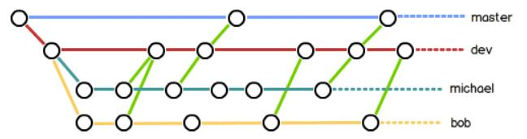

# CheatSheet for Git

[official website](https://git-scm.com/)

### 1. 创建版本库
```
git init
git add <filename>
git add -A  提交所有变化
git add -u  提交被修改(modified)和被删除(deleted)文件，不包括新文件(new)
git add .  提交新文件(new)和被修改(modified)文件，不包括被删除(deleted)文件
git commit -m <message>
```
### 2. 时光穿梭机
- 查看当前状态与文件的修改之处
```
git status
git diff <filename>
git diff HEAD -- <filename>
```
- 查看修改日志
```
git log
git log --pretty=online
git reflog
```
- 版本退回
```
git reset --hard HEAD^
git reset --hard (commit ID)
```
- 撤销修改
```
git reset HEAD <filename> //撤销暂存区内容
git checkout -- <filename> //丢弃工作区内容
```
- 删除文件
```
rm <filename> //删除本地文件
git rm <filename> // 删除版本库里面的文件
git commit -m "message" //将操作提交给Git
git checkout -- <filename> //恢复版本删去的内容
```

### 3.远程仓库
```
git remote add origin git@github.com:xiaojkql/<repo.name>.git
git push -u origin master
git push origin master
```

### 4. 分支管理
- 创建分支
```
git checkout -b fenzhi 		//创建并切换到分支
git branch fenzhi 			   //创建分支
git checkout fenzhi          //切换到分支
git branch				  		  //查看当前分支
git merge fenzhi 			  //将分支融合到master
git branch -d fenzhi		 //删除分支
```
- 解决冲突
当两个分支有同一个文件时，在两个分支上都做了修改就会出现冲突
```
git log --graph --pretty=oneline --abbrev-commit
```
-分支管理策略
```
git merge --no-ff -m "merge with no-ff" dev
git log
```


- bug分支
```
git status
git stash //将当前工作区的内容缓存
git checkout master
git checkout -b issue-101
git add <filename>
git commit -m "fixed bug"
git checkout master
git merge --no-ff-m"merged bug fix" issue-101
git checkout dev
git status
git stash list
git stash apply
git stash drop
or
git stash pop
git stash apply stash@{number}
```

- feaeture 分支
```
git branch -D<branchname> //强行删除
```
- 多人协作
```
git remote
git remote -v
git push origin master
git push origin branchName
git checkout -b branchName origin/branchName
git pull
git branch --set-upstream-to=origin/branchName branchName
git pull
git commit -m "message" //解决冲突
git push origin branch name
and
git pull
git add
git commit
git rebase
git push
```
### 5 错误

- 1信息： fatal: refusing to merge unrelated histories
- 解决办法 git pull origin master --allow-unrelated-histories

- 2信息fatal: remote origin already exists.
-  解决办法 git remote rm origin///// 或者vi .git/config(手动修改配置)

### 6.Git Gui

[Source Tree](https://www.sourcetreeapp.com/)

当使用Source Tree 时需要使用另一个版本控制系统BitBucket

使用方法：先暂存，然后提交到本地仓库(git commit -m)，推送（push）

[教程]()

### 7在pycharm中使用git


